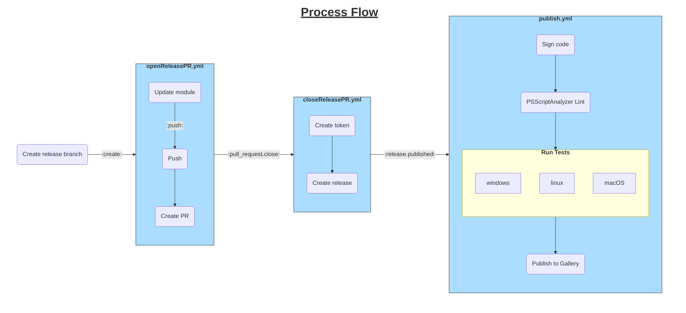

# AnsiConsole

A PowerShell module which supports ANSI console operations. This module provides
functions for colorizing and positioning on the console using ANSI escape
sequences. The functions create formatted output using ANSI escape sequences.

The easiest way to use the module is to pipe strings through `Set-AnsiConsole`,
passing the results back to the host terminal for display. For example:

```pwsh
   "This is red" | Set-AnsiConsole -Foreground BrightRed -Bold
   "This is using an RGB value and italics" | Set-AnsiConsole -ForegroundRGB FF3355 -Italic
```

Additional functions are provided for specific functionality, including bold, dim,
italic, underline, and foreground/background color settings. The color settings can
be configured using the 16 defined ANSI colors, the 256 palette colors, or RGB values
provided in hexadecimal format (with or without the leading `#`).

By default, the included functions will automatically apply an ANSI reset to the end
of each string. This can be disabled by using `Set-AnsiAutoReset` to configure the
default behavior:

```pwsh
Set-AnsiAutoReset $false
```

## Build Process
The build workflow publishes a module to the [PowerShell Gallery](https://www.powershellgallery.com/packages/AnsiConsole).

The process relies on a few steps:

1. Create a branch in the form `releases/v#.#.#` (manual)
2. [openReleasePR](.github/workflows/openReleasePR.yml) is triggered by the `create` of the specially named branch.
   The workflow updates the [module version](src/AnsiConsole.psd1) and creates a PR to merge the changes
3. Once the PR is merged, the branch is deleted and `pull_request.closed` triggers [closeReleasePR](.github/workflows/closeReleasePR.yml)
   to create a release. Creating a release within a workflow using `GITHUB_TOKEN` and the GitHub CLI will not generate the related events,
   so a token is created using a GitHub App with appropriate permissions. The CLI then uses that token. Since it's a different token,
   the release events will be raised and responded to by the workflows.
4. The `release.published` event triggers [publish.yml](.github/workflows/publish.yml). This signs the PowerShell script and runs
   `PSScriptAnalyzer` on the code. The signing process is only supported on Windows, so a `windows-latest` runner is used. If the
   static analysis is successful, the unit tests for the scripts are run on Windows, Ubuntu, and MacOS runners to ensure the module
   works on all platforms. On Windows, both the Desktop and Core versions are validated. If the test succeeds, the results are queued
   for release to the [PowerShell Gallery](https://www.powershellgallery.com/packages/AnsiConsole).


